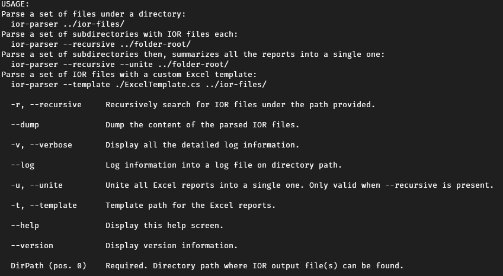

Copyright [2020] [The University of Edinburgh]

Licensed under the Apache License, Version 2.0 (the "License");
you may not use this file except in compliance with the License.
You may obtain a copy of the License at

   http://www.apache.org/licenses/LICENSE-2.0

Unless required by applicable law or agreed to in writing, software
distributed under the License is distributed on an "AS IS" BASIS,
WITHOUT WARRANTIES OR CONDITIONS OF ANY KIND, either express or implied.
See the License for the specific language governing permissions and
limitations under the License.

# iorbenchtool
This small utility parses IOR file(s) into an Excel report.

## Quick usage
The utility can be quickly used by executing `dotnet run -- <args>` under `/src/parser`. See [Usage](#Usage) for detailed information of the arguments of the IOR parser.

## Installation
.Net Core 3.1 SDK must be [installed](https://dotnet.microsoft.com/download/dotnet-core) within the target system. Then follow this steps:
1. Clone this repository and browse into `/src` folder.
1. Execute `dotnet publish -r <RID> -c Release /p:PublishSingleFile=true`, where `RID` can be any of [this list](https://docs.microsoft.com/en-us/dotnet/core/rid-catalog#windows-rids), although it is **only tested on**:
   + win-x64 and win-x86
   + linux-x64
   + linux-arm64
1. The compiled executable is under `/parser/bin/Release/netcoreapp3.1/<RID>/publish`.

## Usage
